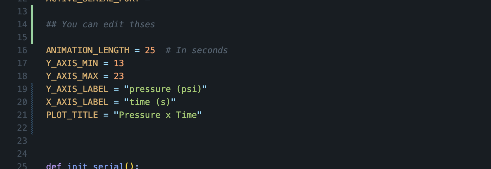

# Read Pressure Sensor Data from Arduino
requires Python 3.10 or higher

## Arduino Setup
The only thing required is that the serial output from the Arduino is formatted as such:
```
time, pressure
```
Time must be in milliseconds. An example would be:
```
12493, 14.24
```

## Python Setup
To run this script, first install the `requirements.txt` file. Open a terminal and run:
```
cd /path/to/directory/read_arduino
pip install -r requirements.txt
```
Then you can run the script using:
```
python3 read_data.py
```

## Usage
Currently, this script supports 2 modes of collection.
1. Live Plotting
2. Recording
3. File Writer / Terminal Output

The modes will be discussed further below. The script will first prompt the user to select the serial port that the arduino is connected to. Most commonly `COM3` for windows users.
If you are unsure of which port you can simply try them all and see which one connects.

### Live Plotting
Live plotting will read the data from the serial port and plot the data in a live graph using `matplotlib`. This mode is potentially the most useful, but can be very strainig on older
laptops. Occasionally the graph will bug out, in those cases, force quit the program and retry. This shouldn't happen often. If it does, consider switching to recording.

### Recording
Recording mode will simply record the values from the serial output for a certain amount of time and then plot it afterwards. To use this mode select the `Record plot` option from
the main menu. This will prompt you for a recording time length and then will begin the process of recording.

### File Writer
This mode simply records the output from the serial port to a file and displays it live in the terminal. This would be useful for exporting data to another program like Excel. A 
sample output file csv is shown in the `output` directory. To end the file writing and output simply hit `Ctrl + C`

### Changing Settings
Modifiable settings:
1. ANIMATION_LENGTH
2. Y_AXIS_MIN
3. Y_AXIS_MAX

#### Animation Length
For live plotting the x-axis does not resize. So once the time values surpass the highest value on the x-axis, it will go out of view. This
variable adjusts how big the window of visible x-values there are. 

#### Y Axis Minimum
This sets the minimum y-axis value.

#### Y Axis Maximum
This sets the maximum y-axis value.

#### Where to change these settings
These settings are found in `read_data.py`. Below is a screenshot with the default values.


## Sample selections
Here's a sample of menu options you might choose


